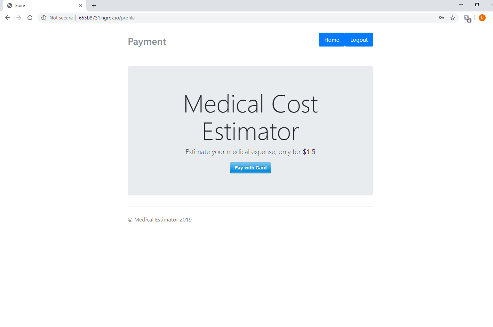
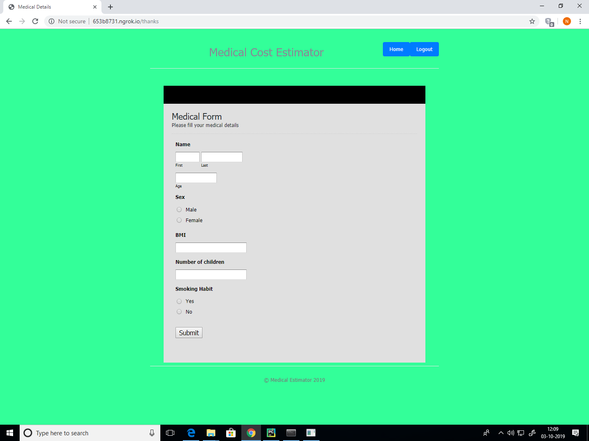
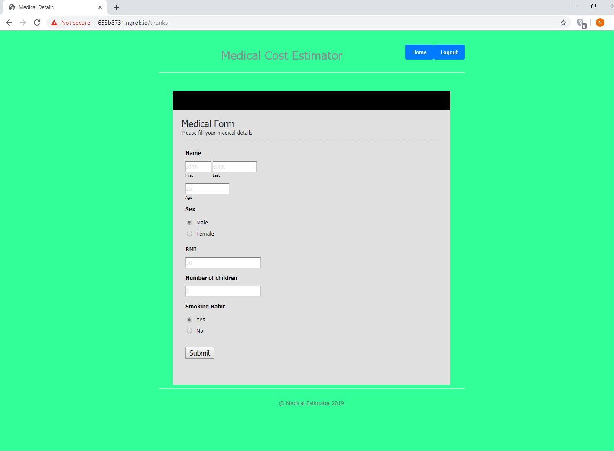
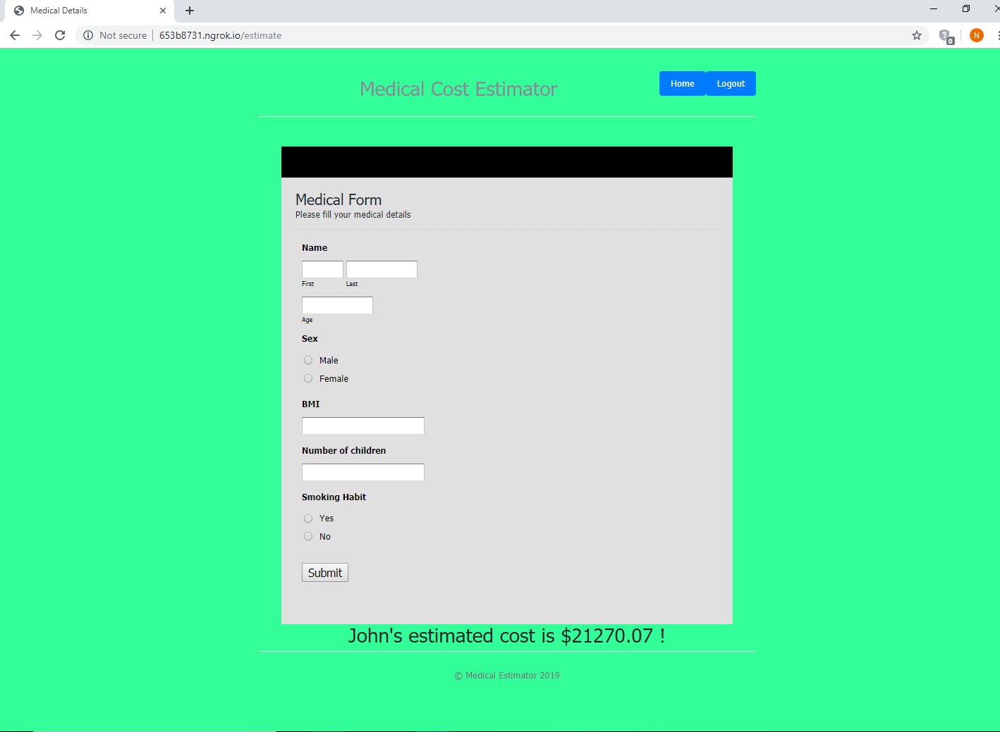

# Medical Cost Estimator Startup

This repository demonstrates a medical cost estimator startup project which makes use of Machine Learning in order to predict medical expenses of people given a certain attributes about them. 

This startup is the mid-term assignment for the course "Make Money With Machine Learning" and has been deployed as a web-application using ```flask```. The payment method has been setup using ```stripe```. 

The accuracy of this model in predicting expenses is close to ```83%``` and has been trained on insurance data. [This](https://github.com/namas191297/medical_cost_eda) is the repository demonstrating the EDA for this startup project and [this](https://github.com/namas191297/medicalcost_random_forest) demonstrates how the model was prepared and trained.

## Screenshots











## Contributors
https://github.com/Pratik2587
https://github.com/namas191297

## License
[MIT](https://choosealicense.com/licenses/mit/)
